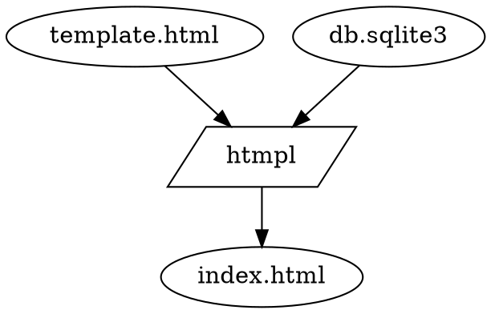

htmpl is a library for generating HTML files from HTML templates.

# TL;DR

```rust
#   pub const CCECKMAN_UUID: &str = "18adfb4d-6a38-4c81-b2e8-4d59e6467c9f";
#   pub const OTHER_UUID: &str = "6de21789-6279-416c-9025-d090d407bc8c";

#   fn main() {
#     let conn = rusqlite::Connection::open_in_memory().unwrap();
#         conn.execute(
#                 r#"
#     CREATE TABLE users
#     (   uuid    TEXT PRIMARY KEY NOT NULL
#     ,   name    TEXT NOT NULL
#     ,   UNIQUE(uuid)
#     ,   UNIQUE(name)
#     );
#                 "#, []).unwrap();

#         conn.execute(
#             r#"INSERT INTO users (uuid, name) VALUES (?, ?), (?, ?)"#,
#             rusqlite::params![CCECKMAN_UUID, "cceckman", OTHER_UUID, "ddedkman"],
#         ).unwrap();
const TEMPLATE : &str = r#"
<htmpl-query name="q">SELECT name, uuid FROM users;</htmpl-query>
<htmpl-foreach query="q">
<htmpl-insert query="q(uuid)" ></htmpl-insert> <htmpl-insert query="q(name)" ></htmpl-insert></htmpl-foreach>
"#;
let result = htmpl::evaluate_template(TEMPLATE, &conn).unwrap();
assert_eq!(result.trim(),
"18adfb4d-6a38-4c81-b2e8-4d59e6467c9f cceckman
6de21789-6279-416c-9025-d090d407bc8c ddedkman");
#   }
```

htmpl evaluates a *template* in the context of a *database*.
The template is an HTML document, with custom `htmpl-` elements
that describe how to alter document
based on data from the database.
The resulting altered document is the output of evaluation.

<!--

-->

The `htmpl-` elements are:

- [`htmpl-query`](#htmpl-query): executes a query on the database and saves the results
- [`htmpl-insert`](#htmpl-insert): inserts a value from a previous query into the output
- [`htmpl-foreach`](#htmpl-foreach): repeats a portion of the input template for each row of a previous query
- [`htmpl-attr`](#htmpl-attr): adds an attribute to selected HTML nodes
- [`htmpl-if`](#htmpl-if): conditionally outputs its content

Between SQL queries[^sqlite] in `htmpl-query`, and the rest of the elements,
you can generate a lot (maybe any?) HTML. _The only limit is your imagination._

# Details

htmpl walks down the DOM tree recursively.
Each step down the tree introduces a new _scope_
in which query results can be bound to names.

When htmpl encounters an `htmpl-` element during this walk,
it evaluates it, per the below.

## `htmpl-query`

```rust
pub const CCECKMAN_UUID: &str = "18adfb4d-6a38-4c81-b2e8-4d59e6467c9f";
#   pub const OTHER_UUID: &str = "6de21789-6279-416c-9025-d090d407bc8c";
#
#   fn main() {
#     let conn = rusqlite::Connection::open_in_memory().unwrap();
#         conn.execute(
#                 r#"
#     CREATE TABLE users
#     (   uuid    TEXT PRIMARY KEY NOT NULL
#     ,   name    TEXT NOT NULL
#     ,   UNIQUE(uuid)
#     ,   UNIQUE(name)
#     );
#                 "#, []).unwrap();
#
conn.execute(
    r#"INSERT INTO users (uuid, name) VALUES (?, ?), (?, ?)"#,
    rusqlite::params![CCECKMAN_UUID, "cceckman", OTHER_UUID, "ddedkman"],
).unwrap();

const TEMPLATE : &str = r#"
    <htmpl-query name="const_uuid">
        SELECT "18adfb4d-6a38-4c81-b2e8-4d59e6467c9f" AS uuid_value;
    </htmpl-query>
    <htmpl-query name="get_name" :uuid="const_uuid(uuid_value)" >
        SELECT name FROM users WHERE uuid = :uuid;
    </htmpl-query>
    <htmpl-insert query="get_name(name)" ></htmpl-insert>
"#;
let result = htmpl::evaluate_template(TEMPLATE, &conn).unwrap();
assert_eq!(result.trim(), "cceckman");
# }
```

The content of the `htmpl-query` element is the SQL query.

The query may have parameters.
For each parameter in the query, htmpl will look for an attribute
on the `htmpl-query` element with the same name as the parameter.
(We recommend colon-prefixed names, e.g. `:hello`,
as they are valid parameter names and valid attribute names.)

In addition, the `name` attribute gives a name to the query's results.

Note the above example also demonstrates how to generate "constants"
-- in this case, the UUID in the `const_uuid` query.


## `htmpl-insert`

-   `query` attribute names a [selector](#selector)

    TODO: I should rename this, it's not a query

-   Stringifies that value
    - "string" affinity: just inserts the string
    - "integer" affinity: base-10
    - "real" affinity: ??? (Rust default format)
    - "byte" affinity: comma-separated hex bytes (let me know if you want something more sensible!)


### Selectors {#selector}

TODO: Rename; need to distinguish CSS selectors.

_Selectors_ are how data makes it back from SQL to the HTML document.
A selector names a single (scalar) value from a previous query.

Selectors are used the `htmpl-insert` element's `query` attribute,
as well as all parameter-providing attributes in an `htmpl-query`.

-   Must name a query in the current scope or a parent scope.
-   Query must name a single row. (See below on [foreach](#htmpl-foreach) for how to move from multiple rows to just-one.)
-   Query must either contain a single column per row,
    or name a column.

Query-only form (if the query resulted in a single column): `query_name`

Query+column form: `query_name(column_name)`

## `htmpl-foreach`

-   `query` attribute names a `query` (note: not a selector, an actual query)
-   For each row of that query's results, evaluate the template within the `htmpl-foreach` element,
    with the named `query` replaced with a single-row result.

    i.e. for each row of the result, evaluate the inner template as if the query had returned just one row.

Note that, if the query returned no rows, the inner template will not appear at all.

## `htmpl-attr`

You may note that the above allows you to _insert_ DOM nodes, but not to specify attributes.

The `htmpl-attr` sets an attribute to a variable value. An `htmpl-attr` modifies nodes:
- that are in its current scope (i.e. under the same parent)
- that are after the `htmpl-attr` in the source
- that are identified by a CSS selector
- that are not htmpl elements

```rust
#   pub const CCECKMAN_UUID: &str = "18adfb4d-6a38-4c81-b2e8-4d59e6467c9f";
#   pub const OTHER_UUID: &str = "6de21789-6279-416c-9025-d090d407bc8c";

#   fn main() {
#     let conn = rusqlite::Connection::open_in_memory().unwrap();
#         conn.execute(
#                 r#"
#     CREATE TABLE users
#     (   uuid    TEXT PRIMARY KEY NOT NULL
#     ,   name    TEXT NOT NULL
#     ,   UNIQUE(uuid)
#     ,   UNIQUE(name)
#     );
#                 "#, []).unwrap();

#         conn.execute(
#             r#"INSERT INTO users (uuid, name) VALUES (?, ?), (?, ?)"#,
#             rusqlite::params![CCECKMAN_UUID, "cceckman", OTHER_UUID, "ddedkman"],
#         ).unwrap();
    const TEMPLATE : &str = r#"
<htmpl-query name="q">SELECT name, (uuid || " name") AS uuid_class FROM users ORDER BY name ASC LIMIT 1;</htmpl-query>
<htmpl-attr select=".name" query="q(uuid_class)" attr="class" ></htmpl-attr>
<div class="name"><htmpl-insert query="q(name)"></htmpl-insert></div>
"#;
    let result = htmpl::evaluate_template(TEMPLATE, &conn).unwrap();
    assert_eq!(result.trim(), r#"<div class="18adfb4d-6a38-4c81-b2e8-4d59e6467c9f name">cceckman</div>"#);
#   }
```

```rust
#   pub const CCECKMAN_UUID: &str = "18adfb4d-6a38-4c81-b2e8-4d59e6467c9f";
#   pub const OTHER_UUID: &str = "6de21789-6279-416c-9025-d090d407bc8c";

#   fn main() {
#     let conn = rusqlite::Connection::open_in_memory().unwrap();
#         conn.execute(
#                 r#"
#     CREATE TABLE users
#     (   uuid    TEXT PRIMARY KEY NOT NULL
#     ,   name    TEXT NOT NULL
#     ,   UNIQUE(uuid)
#     ,   UNIQUE(name)
#     );
#                 "#, []).unwrap();

#         conn.execute(
#             r#"INSERT INTO users (uuid, name) VALUES (?, ?), (?, ?)"#,
#             rusqlite::params![CCECKMAN_UUID, "cceckman", OTHER_UUID, "ddedkman"],
#         ).unwrap();
    const TEMPLATE : &str = r#"
<htmpl-query name="q">
    SELECT
        name
    ,   ("name item-" || ROW_NUMBER() OVER (ORDER BY name)) AS class
    FROM users;
</htmpl-query>
<htmpl-foreach query="q"><htmpl-attr select=".name" query="q(class)" attr="class" ></htmpl-attr>
<div class="name"><htmpl-insert query="q(name)"></htmpl-insert></div></htmpl-foreach>
"#;
    let result = htmpl::evaluate_template(TEMPLATE, &conn).expect("unexpected error");
    assert_eq!(result.trim(), r#"
<div class="name item-1">cceckman</div>
<div class="name item-2">ddedkman</div>
"#.trim());
#   }
```

## `htmpl-if`

Conditional evaluation of its body.
Name a [selector](#selector) with the `true=` attribute or `false=` attribute;
if the truthiness of the expression matches, the body of the `htmpl-if` is evaluated.

Note that, as usual, `htmpl-if` constitutes a scope; a query executed inside an `htmpl-if`
element will not be available outside of the `htmpl-if`.

```rust
   pub const CCECKMAN_UUID: &str = "18adfb4d-6a38-4c81-b2e8-4d59e6467c9f";
#   pub const OTHER_UUID: &str = "6de21789-6279-416c-9025-d090d407bc8c";

#   fn main() {
#     let conn = rusqlite::Connection::open_in_memory().unwrap();
#     conn.execute(
#                 r#"
#     CREATE TABLE posts
#     (     id      INTEGER PRIMARY KEY NOT NULL
#     ,     title   TEXT NOT NULL
#     ,     text    TEXT NOT NULL
#     ,     draft   INTEGER NOT NULL
#     );
#                 "#, []).unwrap();

      conn.execute(
        r#"INSERT INTO posts (title, text, draft) VALUES (?, ?, ?), (?, ?, ?)"#,
        rusqlite::params![
            "First Post", "This is my first post!", 0,
            "Second Post", "This is my second post! But it isn't ready yet.", 1,
        ],
      ).unwrap();
      const TEMPLATE : &str = r#"
        <htmpl-query name="q">SELECT title, text, draft FROM posts;</htmpl-query>
        <htmpl-foreach query="q">
        <h1><htmpl-insert query="q(title)"></htmpl-insert><htmpl-if true="q(draft)"> (Draft)</htmpl-if></h1>
        <p><htmpl-insert query="q(text)"></htmpl-insert></p>
        </htmpl-foreach>
      "#;
      let result = htmpl::evaluate_template(TEMPLATE, &conn).expect("unexpected error");
      assert_eq!(result.trim(), r#"
        <h1>First Post</h1>
        <p>This is my first post!</p>
        
        <h1>Second Post (Draft)</h1>
        <p>This is my second post! But it isn't ready yet.</p>
      "#.trim());
    }
```

### Truthiness

Truthiness depends on the affinity of the type.

Null values are always false. Beyond that, truthiness depends on the value's affinity:

- Integer: 0 is falsy, all other values are truthy
- String: the empty strings is falsy, all nonempty strings truthy
- Real: Positive zero, negative zero, and NaN are falsy; all other value truthy
- Blob: Empty (zero-length) blobs are falsy, all other values truthy

# Caveats

- "Database" is, for now, a single SQLite database.
- TODO: The database is (should be) read-only. htmpl is not PHP -- it is a templating language, not a programming language.

