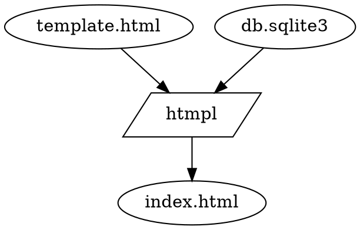

htmpl is a library for generating HTML files from HTML templates.

# TL;DR

```rust
#   pub const CCECKMAN_UUID: &str = "18adfb4d-6a38-4c81-b2e8-4d59e6467c9f";
#   pub const OTHER_UUID: &str = "6de21789-6279-416c-9025-d090d407bc8c";

#   fn main() {
#     let conn = rusqlite::Connection::open_in_memory().unwrap();
#         conn.execute(
#                 r#"
#     CREATE TABLE users
#     (   uuid    TEXT PRIMARY KEY NOT NULL
#     ,   name    TEXT NOT NULL
#     ,   UNIQUE(uuid)
#     ,   UNIQUE(name)
#     );
#                 "#, []).unwrap();

#         conn.execute(
#             r#"INSERT INTO users (uuid, name) VALUES (?, ?), (?, ?)"#,
#             rusqlite::params![CCECKMAN_UUID, "cceckman", OTHER_UUID, "ddedkman"],
#         ).unwrap();
    const TEMPLATE : &str = r#"
<htmpl-query name="q">SELECT name, uuid FROM users;</htmpl-query>
<htmpl-foreach query="q">
<htmpl-insert query="q(uuid)" /> <htmpl-insert query="q(name)" /></htmpl-foreach>
"#;
    let result = htmpl::evaluate_template(TEMPLATE, &conn).unwrap();
    assert_eq!(result.trim(),
"18adfb4d-6a38-4c81-b2e8-4d59e6467c9f cceckman
6de21789-6279-416c-9025-d090d407bc8c ddedkman");
#   }
```

# Outline and examples

The htmpl library takes in two inputs: a `template`,
which is an HTML document with some htmpl-specific elements;
and a `database`. htmpl replaces the htmpl elements in the template,
producing an output HTML document.



The htmpl elements are:

- `htmpl-query`, which executes a query on the database and saves the results
- `htmpl-insert`, which inserts a value from a previous query into the output
- `htmpl-foreach`, which repeats a portion of the input template for each row of a previous query

These are sufficient to do a lot of dynamic HTML documentation. _The only limit is your imagination._

# Details

Recursive descent down the DOM tree.

## `htmpl-query`

-   `name` attribute to name the query. Use this for reference later.
-   After the element is evaluated, that name is "all the results": rows of column -> value mappings. See section on [selectors](#selector) for how to access the value.
-   Scoped: name is defined within the parent element, not outside.
-   Names can shadow within inner scopes.
-   The query can take parameters:
    -   In the query, use named parameters, starting with a colon (e.g. `:foo`)
    -   In the element, use an attribute.
        The attribute name is the same as the parameter name (e.g. `:foo`);
        its value is a [selector](#selector).

    For instance:

    ```rust
        pub const CCECKMAN_UUID: &str = "18adfb4d-6a38-4c81-b2e8-4d59e6467c9f";
    #   pub const OTHER_UUID: &str = "6de21789-6279-416c-9025-d090d407bc8c";
    #
    #   fn main() {
    #     let conn = rusqlite::Connection::open_in_memory().unwrap();
    #         conn.execute(
    #                 r#"
    #     CREATE TABLE users
    #     (   uuid    TEXT PRIMARY KEY NOT NULL
    #     ,   name    TEXT NOT NULL
    #     ,   UNIQUE(uuid)
    #     ,   UNIQUE(name)
    #     );
    #                 "#, []).unwrap();
    #
              conn.execute(
                  r#"INSERT INTO users (uuid, name) VALUES (?, ?), (?, ?)"#,
                  rusqlite::params![CCECKMAN_UUID, "cceckman", OTHER_UUID, "ddedkman"],
              ).unwrap();
        let TEMPLATE : &str = r#"
    <htmpl-query name="const_uuid">SELECT "18adfb4d-6a38-4c81-b2e8-4d59e6467c9f" AS uuid_value;</htmpl-query>
    <htmpl-query name="get_name" :uuid="const_uuid(uuid_value)" >SELECT name FROM users WHERE uuid = :uuid;</htmpl-query>
    <htmpl-insert query="get_name(name)" />
    "#;
        let result = htmpl::evaluate_template(TEMPLATE, &conn).unwrap();
        assert_eq!(result.trim(), "cceckman");
    # }

    ```

    Note this example also demonstrates how to turn "constants"
    into variables -- in this case, the UUID in the `const_uuid` query.

## `htmpl-insert`

-   `query` attribute names a [selector](#selector)

    TODO: I should rename this, it's not a query

-   Stringifies that value
    - "string" affinity: just inserts the string
    - "integer" affinity: base-10
    - "real" affinity: ??? (Rust default format)
    - "byte" affinity: comma-separated hex bytes (let me know if you want something more sensible!)


### Selectors {#selector}

TODO: Rename; need to distinguish CSS selectors.

_Selectors_ are how data makes it back from SQL to the HTML document.
A selector names a single (scalar) value from a previous query.

Selectors are used the `htmpl-insert` element's `query` attribute,
as well as all parameter-providing attributes in an `htmpl-query`.

-   Must name a query in the current scope or a parent scope.
-   Query must name a single row. (See below on [foreach](#htmpl-foreach) for how to move from multiple rows to just-one.)
-   Query must either contain a single column per row,
    or name a column.

Query-only form (if the query resulted in a single column): `query_name`

Query+column form: `query_name(column_name)`

## `htmpl-foreach`

-   `query` attribute names a `query` (note: not a selector, an actual query)
-   For each row of that query's results, evaluate the template within the `htmpl-foreach` element,
    with the named `query` replaced with a single-row result.

    i.e. for each row of the result, evaluate the inner template as if the query had returned just one row.

Note that, if the query returned no rows, the inner template will not appear at all.

## `htmpl-attr`

You may note that the aboe allows you to _insert_ DOM nodes, but not to specify their attributes.

The `htmpl-attr` sets an attribute to a variable value. An `htmpl-attr` modifies nodes:
- that are in its current scope (i.e. under the same parent)
- that are after the `htmpl-attr` in the source
- that are identified by a CSS selector
- that are not htmpl elements

```rust
#   pub const CCECKMAN_UUID: &str = "18adfb4d-6a38-4c81-b2e8-4d59e6467c9f";
#   pub const OTHER_UUID: &str = "6de21789-6279-416c-9025-d090d407bc8c";

#   fn main() {
#     let conn = rusqlite::Connection::open_in_memory().unwrap();
#         conn.execute(
#                 r#"
#     CREATE TABLE users
#     (   uuid    TEXT PRIMARY KEY NOT NULL
#     ,   name    TEXT NOT NULL
#     ,   UNIQUE(uuid)
#     ,   UNIQUE(name)
#     );
#                 "#, []).unwrap();

#         conn.execute(
#             r#"INSERT INTO users (uuid, name) VALUES (?, ?), (?, ?)"#,
#             rusqlite::params![CCECKMAN_UUID, "cceckman", OTHER_UUID, "ddedkman"],
#         ).unwrap();
    const TEMPLATE : &str = r#"
<htmpl-query name="q">SELECT name, (uuid || " name") AS uuid_class FROM users ORDER BY name ASC LIMIT 1;</htmpl-query>
<htmpl-attr select=".name" query="q(uuid_class)" attr="class" />
<div class="name"><htmpl-insert query="q(name)" /></div>
"#;
    let result = htmpl::evaluate_template(TEMPLATE, &conn).unwrap();
    assert_eq!(result.trim(), r#"<div class="18adfb4d-6a38-4c81-b2e8-4d59e6467c9f name">cceckman</div>"#);
#   }
```


# Caveats

- "Database" is, for now, a single SQLite database.
- TODO: The database is (should be) read-only. htmpl is not PHP -- it is a templating language, not a programming language.

